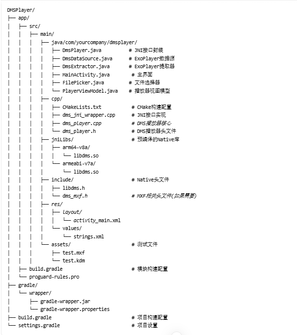

**DMS (Digital Cinema Package Library)**

**DCP（数字电影包）**

**KDM (密钥分发消息)**

使用说明
​​项目设置​​：

将提供的 libdms.so文件放入 app/src/main/jniLibs/arm64-v8a/和 app/src/main/jniLibs/armeabi-v7a/目录

将 libdms.h头文件放入 app/src/main/include/目录

​​编译运行​​：

使用 Android Studio 打开项目

连接 Android 设备或启动模拟器

点击 "Run" 按钮编译并运行应用

​​测试流程​​：

点击 "Select MXF" 选择 MXF 文件

点击 "Select KDM" 选择 KDM 文件（可选）

点击 "Play" 开始播放

点击 "Stop" 停止播放

注意事项
当前实现使用 DCP 函数来处理 MXF 文件，这是一个临时解决方案

在实际应用中，需要与版权方确认是否有直接操作 MXF 文件的接口

时间戳到文件位置的转换是简化的，实际实现需要更精确的映射

错误处理和日志记录需要进一步完善

性能优化和内存管理需要根据实际测试进行调整

这个实现提供了一个完整的基础框架，您可以根据实际需求进行扩展和优化